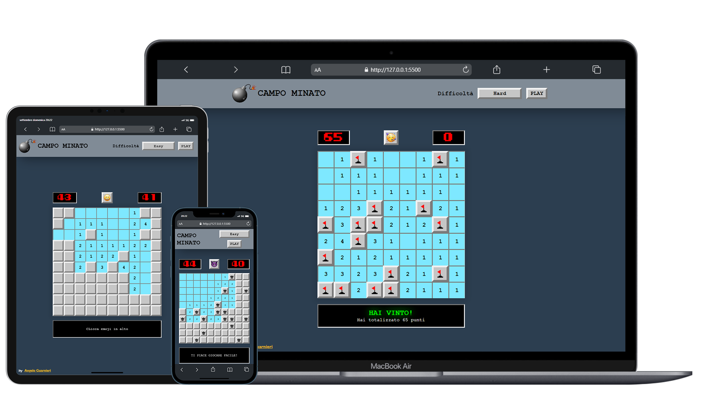

 

<h1 align="center" title="Unicode Formatter">ＣＡＭＰＯＭＩＮＡＴＯ</h1>

💣 Pᴇʀꜱᴏɴᴀʟ Mɪɴᴇꜱᴡᴇᴇᴩᴇʀ ɢᴀᴍᴇ 💥

<h3 align="center">
𝙑𝙞𝙚𝙬 𝙨𝙞𝙩𝙚

</h3>

## 

## ⛏️ Tecnologies, addons and plugins used
- [HTML](https://html.com);
- [CSS](https://www.w3.org/TR/CSS/);
- [JavaScript](https://devdocs.io/javascript/);

## 👨‍💻 Authors
- [@ilguarnieri](https://www.flowcode.com/page/ilguarnieri)
